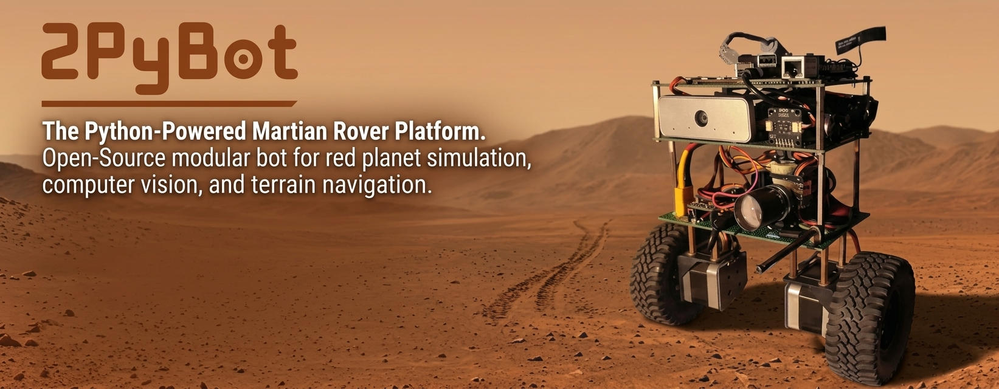

# 2PyBot: Self-Balancing Robot

[](firmware/BaseLink/)
[](docs/BaseLink/PID_Theory_and_Math.md)
[](firmware/BaseLink/README.md)
[](https://github.com/atharvap8/2PyBot/actions/workflows/firmware-ci.yml)
[](https://github.com/atharvap8/2PyBot/actions/workflows/python-lint.yml)
[](https://github.com/atharvap8/2PyBot/actions/workflows/docs-check.yml)

2PyBot is an ESP32 self-balancing robot with NEMA 17 steppers, TMC2226 drivers, MT6816 wheel encoders, and an ISM6HG256X IMU. The firmware uses **LQR/LQI state feedback** for balance and position hold. An EVOFOX One S gamepad pairs directly through Bluepad32. USB serial carries host drive commands, telemetry, and parameter tuning.

## Current firmware

- 200 Hz control loop using pitch, pitch rate, wheel position, velocity, and position integral.
- 20 kHz timer ISR for STEP/DIR pulses; hardware PCNT for encoder counts.
- Encoder-differential heading hold and slew-limited steering.
- Normal hold, stiff hold, velocity tracking, and climb reference tracking.
- Terrain roughness, airborne, and landing detection with pitch-gain softening.
- 106 runtime parameters with per-value bounds and NVS save/load.
- Auto-tuning routines for wobble, trim, radius, and stall speed, with current limitations documented in the tuning guide.
- WS2812 status ring, camera pan/zoom servos, and PWM torch.

## Control and communication

The gamepad's left stick drives and steers. The right stick pans and zooms the camera. START requests arming; SELECT stops balancing. LB toggles LOW/HIGH speed, RB toggles the torch, and the D-pad controls hold modes and torch brightness.

Fresh host `V,<forward>,<steering>,<enable>` commands take priority over gamepad driving. `V` commands do not arm the robot. Use gamepad START or serial `E`. With no fresh input, drive commands become zero and balancing continues.

USB serial runs at **460800 baud**. The firmware emits `O` odometry at 50 Hz and `D` debug telemetry at a nominal 100 Hz. Debug starts enabled; `L` toggles it. See the [serial protocol](firmware/BaseLink/PROTOCOL.md) for fields and commands.

## Repository layout

```text
firmware/
  BaseLink/                 Robot firmware and serial protocol
    BaseLink.ino            State machine, control, input arbitration
    config.h                Pins and compiled defaults
    params.h / params.cpp   Runtime parameters and NVS persistence
    autotune.h              Calibration and tuning routines
    terrain.h               Roughness, airborne, and landing detection
    bt_gamepad.h            Bluepad32 input mapping
    imu_sensor.h / .cpp      Mahony attitude estimation
    stepper_control.h / .cpp TMC2226 configuration, PCNT, step ISR
    led_ring.h / .cpp        WS2812 status display
    payload.h               Camera servos and torch
  Controller/               Legacy ESP-NOW joystick transmitter
software/
  android/                  Kotlin/Compose Android app
  radxa/
    console/                Current browser console and Android API
    deployment/             Installed services, MediaMTX, and device rules
  runtime/vision_controller/ Older collision guard and person follower
gui/                        Legacy PID desktop interface
tools/
  controller_lab/           Browser simulation lab
  tuner/                    Legacy Web Serial PID tuner
docs/                       Architecture, control theory, tuning, history
scripts/                    Model generation and Radxa utilities
hardware/cad/enclosure/rev5/ OpenSCAD enclosure source and STL exports
models/                     CAD assets
assets/                     Project media
```

## Build and first connection

1. Install the ESP32 + Bluepad32 board package and the libraries listed in the [firmware setup guide](firmware/BaseLink/README.md).
2. Select ESP32 Dev Module with the Huge APP partition scheme.
3. Open `firmware/BaseLink/BaseLink.ino`, review the pin assignments in `config.h`, and flash.
4. Open USB serial at 460800 baud with newline termination. Check the IMU and driver boot messages, then send `P?` to inspect loaded parameters.
5. Pair the EVOFOX One S in Home+B mode. Leave both sticks centered while calibration completes.
6. Verify motor and sensor signs using the [configuration guide](docs/BaseLink/Config_and_Tuning_Guide.md), then request arming while upright.

Saved NVS parameters take precedence over compiled defaults. `PD` restores defaults in RAM; `PS` saves them.

## Host software status

| Component | Current compatibility |
| :--- | :--- |
| USB terminal or custom serial client | Supports the current parameter and telemetry protocol |
| `software/radxa/console/` | Current Radxa console: 460800 baud, live parameter metadata, browser UI, Android API, and WebRTC camera |
| `software/android/` | Kotlin/Compose client for console HTTP/WebSocket and MediaMTX WHEP; parameter groups are dynamic |
| `software/runtime/vision_controller/radxa_brain.py` | Uses `O` and `V` messages, but still has 115200 baud and 0.035 m radius constants; align both before use |
| `gui/robot_controller_ui.py` | Legacy PID UI: 115200 baud, tab-separated telemetry, and `$` commands; needs a protocol update |
| `tools/tuner/tuner.html` | Legacy Web Serial PID tuner; not a current parameter-store client |
| `firmware/Controller/Controller.ino` | Legacy ESP-NOW transmitter; current BaseLink has no ESP-NOW receiver |

The current console package was imported from the Cubie A7A. See its [setup and API guide](software/radxa/console/README.md) and [deployment layout](software/radxa/README.md). Its debug parser reads the original 15 fields; terrain telemetry and a terrain parameter tab remain pending.

The older Radxa brain provides GUARD/FOLLOW modes. It owns the camera and serial port, so it cannot run alongside the console. See its [setup guide](software/runtime/vision_controller/README_RADXA.md).

The [Android app](software/android/README.md) has Live, Map, Tune, Auto, Camera, and Setup screens. It defaults to the Radxa hotspot address `10.42.0.1`. Its Tune screen includes all groups reported by firmware, including TERRAIN. APK build instructions and CI artifacts are documented with the app.

## Updating the bot

The console runs from `/home/radxa/projects/2PyBot`. After `git pull --ff-only`, a systemd timer applies relevant committed changes and restarts the affected services. Android, CAD, firmware, and documentation changes do not restart the console. See [repo-based deployment](scripts/radxa/README.md) for installation, status, and retry commands.

## Hardware defaults

| Component | Configuration |
| :--- | :--- |
| Robot controller | ESP32 DevKit |
| Wheel drive | Two NEMA 17 motors, TMC2226 drivers, 1/8 microsteps |
| Wheel feedback | MT6816 quadrature encoders, 4096 counts/revolution |
| Wheel radius | 0.050 m compiled default |
| Attitude | ISM6HG256X accelerometer/gyro, Mahony filter |
| Compass | QMC5883L, tilt-compensated yaw telemetry |
| Gamepad | EVOFOX One S through Bluepad32 |
| Status ring | 16 WS2812 LEDs on GPIO 15 |
| Camera payload | MG90S pan/zoom servos on GPIO 26/0; torch on GPIO 2 |

## Enclosure CAD

[Revision 5](hardware/cad/enclosure/rev5/README.md) includes the base tray, shell, face plate, and left/right motor covers as OpenSCAD source and five STL exports. The enclosure is **not yet printed or physically fit-tested**. Estimated dimensions are marked in the source. The imported face STL has three zero-area triangles that need re-export or repair before printing.

The existing simplified STEP model remains in `models/2pybot_simplified.step`; it is separate from the revision-5 enclosure package.

## Documentation

| Document | Contents |
| :--- | :--- |
| [Firmware setup](firmware/BaseLink/README.md) | Build, wiring, pairing, controls |
| [Serial protocol](firmware/BaseLink/PROTOCOL.md) | Commands, parameter records, telemetry fields |
| [Radxa console](software/radxa/console/README.md) | Browser UI, Android API, camera pipeline, deployment |
| [Android app](software/android/README.md) | Build, host connection, screens, parameter and video transport |
| [Radxa deployment](scripts/radxa/README.md) | Git updates, selective restarts, systemd timer, health checks |
| [Enclosure CAD](hardware/cad/enclosure/rev5/README.md) | Revision-5 source, exports, dimensions, and current print status |
| [System architecture](docs/BaseLink/System_Architecture.md) | Sensors, control, actuation, host links |
| [LQR/LQI theory](docs/BaseLink/PID_Theory_and_Math.md) | State feedback, control modes, filtering, limits |
| [Configuration and tuning](docs/BaseLink/Config_and_Tuning_Guide.md) | Defaults, runtime settings, calibration |
| [Program flow](docs/BaseLink/Program_Flow_State_Machine.md) | Boot sequence and state transitions |
| [Troubleshooting](docs/BaseLink/Troubleshooting_Guide.md) | Common faults and source-level checks |
| [Detailed reference](docs/BaseLink/100+_WHAT_AND_HOWS.md) | 126 code-mapped checks |
| [TMC2226 migration](docs/BaseLink/TMC2226_Migration.md) | Driver configuration and migration history |
| [Project history](docs/BaseLink/Project_History.md) | PID, ESP-NOW, LQR/LQI, and runtime-tuning milestones |
| [Legacy transmitter](docs/Controller/System_Architecture.md) | ESP-NOW joystick packet and sampling |
