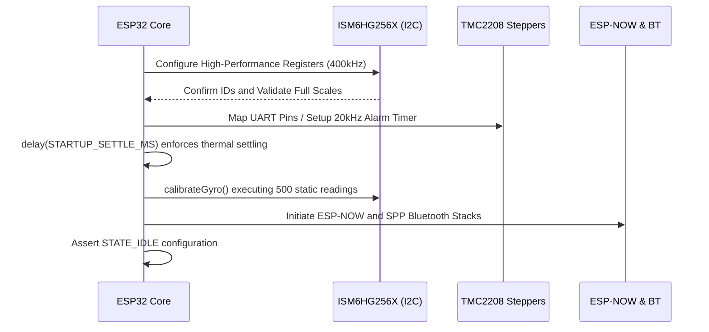
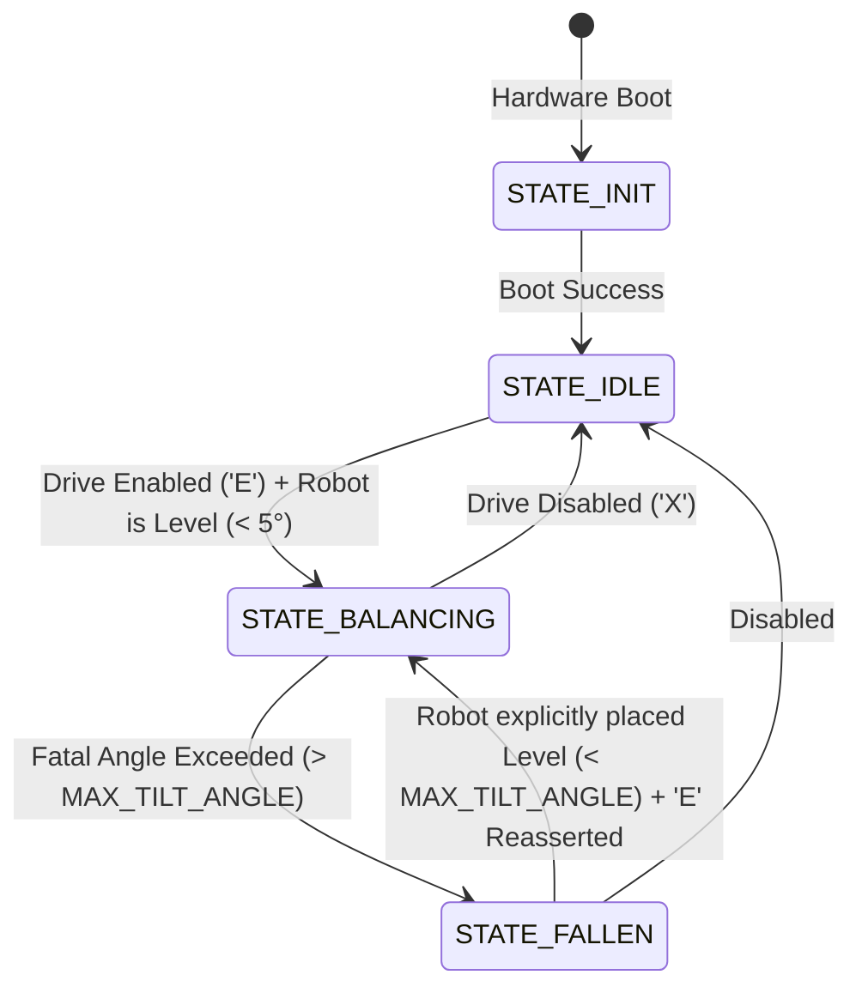

# Program Flow and State Machine Architecture

This document meticulously traces the chronological structure spanning the initialization, evaluation, and physical execution routines inherent to the `Self_Balancing_Robot.ino` firmware.

## Process Initialization & Calibration Flow

Upon triggering the ESP32 microcontroller's `setup()` environment, sequential validation routines operate linearly to bootstrap isolated complex hardware peripherals.

## The State Machine (Finite Automaton)

The central operational methodology explicitly prevents erroneous code from activating powerful steppers without specific conditions being flawlessly met.

### 1. `STATE_INIT`
- Confirms logic availability exclusively. Motors are logically and physically disconnected.
- Calibrates gyroscopic zeroes assuming flawless rigid stillness.

### 2. `STATE_IDLE`
- Dispatches identical diagnostic flashes utilizing the `ONBOARD_LED` representing logical wait status.
- Evaluates positional drift inputs and strictly forces internal compensators identically towards theoretical geometric zero offsets.

### 3. `STATE_BALANCING`
- Executes the entirety of the rigid `LOOP_FREQ_HZ` (200 Hz) mathematical hierarchy.
- Scales visual LED pulse delays proportionally mapping mathematical failure proximities (flashing quicker when structural strain escalates).
- Identifies independent external trajectory requests mapped perfectly against local acceleration physics generating kinetic torque.

### 4. `STATE_FALLEN`
- Safety override triggered actively upon exceeding structurally irrecoverable deviation angles (e.g., $95.0^{\circ}$).
- Slashes identical acceleration limits instantly resolving physical logic gates mapping the Motor `EN` pins directly HIGH.
- Completely locks identical evaluation until specific human interference physically centers the chassis directly perpendicular relative to local gravity, simultaneously resubmitting explicit 'Enable' commands natively via wireless diagnostics.
