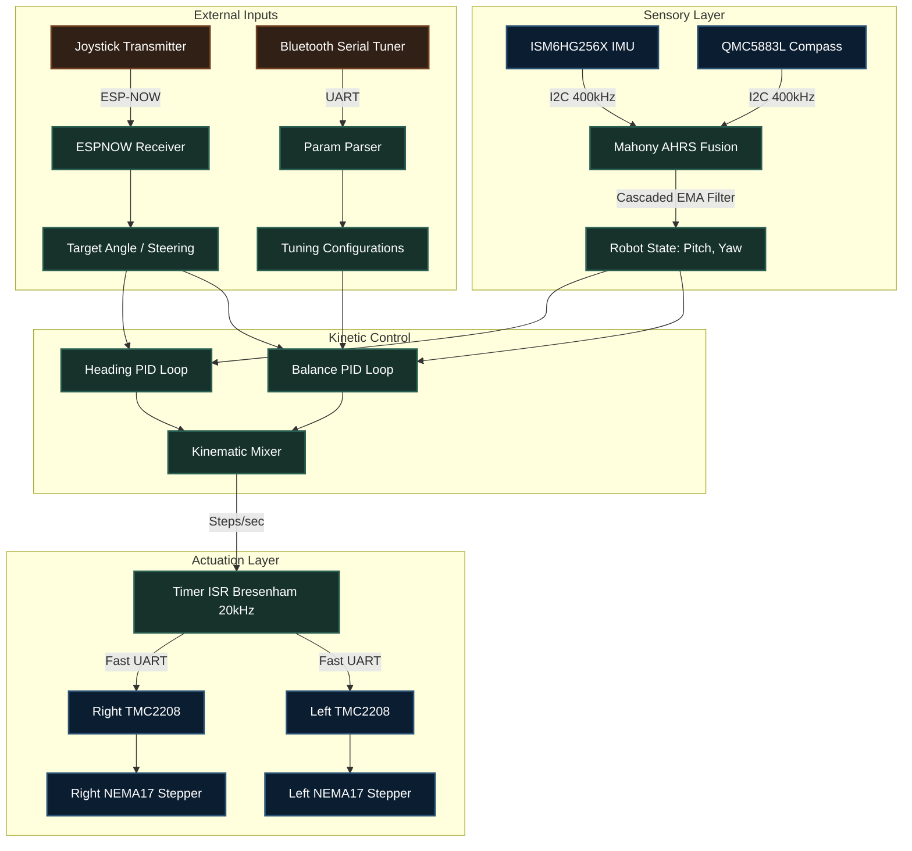

# System Architecture: Self-Balancing Robot

This document outlines the core structural design and hardware-software interaction layers governing the Self-Balancing Robot platform. The architecture is explicitly decoupled, isolating rigid mathematics from variable external inputs to mathematically guarantee chassis stability.

## High-Level Abstraction

The processing pipeline is segmented functionally into three primary execution domains:
1. **Sensory & Fusion Layer**: Retrieves and cleans raw external environmental data.
2. **Kinetic Control Layer**: The mathematical core translating state disparity into reactionary acceleration vectors.
3. **Actuation & Hardware Layer**: Responsible strictly for generating perfectly uniform discrete electrical outputs.

---

## 1. Core Component Interactions

### Sensory and Fusion (I2C at 400kHz)
The rigid foundational measurement stems from an `ISM6HG256X` high-performance 6-axis IMU, supplemented by a `QMC5883L` magnetometer for absolute heading tracking.
- Raw values enter the `Mahony AHRS` mathematical filter.
- The 9-DOF quaternion natively generated shields pitch measurements from magnetic interference, rendering a structurally pure 3D map of the chassis orientation.
- Secondary cascaded `Exponential Moving Average (EMA)` algorithms surgically scrub remaining electromagnetic noise out of the finalized pitch angle variable before it ever reaches the control loops.

### The Mathematics Engine (200 Hz Main Loop)
A rigidly constrained microcontroller loop evaluates exactly 200 times per second ($dt = 0.005s$).
1. Identifies external translation requests (from Bluetooth or ESP-NOW Joystick).
2. The core Balance PID measures the discrepancy between mathematical upright and actual pitch.
3. The Heading PID isolates any lateral variance restricting vehicle travel direction.
4. Calculations are aggregated through a limiter capping acceleration change rates.

### Precision Stepper ISR (20 kHz Hardware Timer)
This layer operates completely detached from the primary logical sequence.
- The physics engine feeds absolute "Steps Per Second" integers exclusively into volatile memory registers.
- A background `Interrupt Service Routine` triggers exactly 20,000 times per second, managing Bresenham Accumulators for each wheel.
- When an accumulator boundary is violated, native silicon overrides trigger the electrical step pin immediately, achieving zero-jitter mechanical pulses.

---

## 2. Communications Ecosystem

The ESP32 processes two disparate concurrent wireless network environments:

### ESP-NOW Remote Manipulation
- An ultra-fast, connectionless protocol fundamentally identical to raw WiFi routing.
- The transmitter establishes fixed payload vectors representing intent, not mechanical realities.
- The robot dynamically incorporates this intent as mathematically filtered offsets against its own gravitational setpoint.

### Bluetooth Classic Serial Diagnostics
- An asynchronous text parser operating on `BluetoothSerial`, permitting complex string evaluations.
- Translates dynamic textual configuration instructions directly into variable manipulation modifying PID structural constraints natively on the fly without demanding code recompilation.

---

## 3. RQT Control Structure Graph

