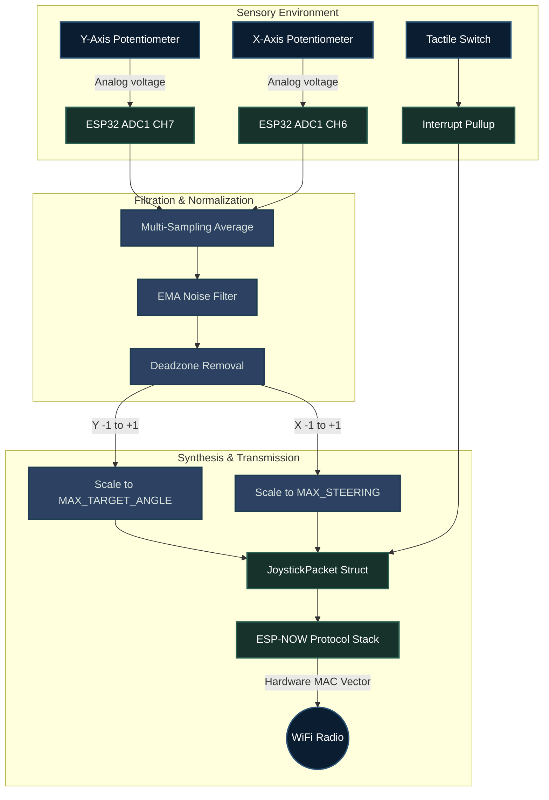

# System Architecture: ESP-NOW Joystick Transmitter

This document delineates the logical construction of the wireless joystick remote controller, designed specifically to operate completely independently of the robotic platform it governs. 

## High-Level Topology

The system operates across three core domains: analog peripheral sampling, signal normalization, and wireless payload compilation.

---

## 1. Subsystem Descriptions

### Analog Acquisition (ADC1 Only)
The ESP32 platform restricts access to ADC2 structures the moment the RF radio engages. Therefore, the architectural hardware interface is strictly limited to ADC1 pins (`GPIO 34`, `GPIO 35`).
- The 12-bit ADC generates inputs ranging linearly between 0 and 4095.
- Mechanical resting center discrepancies observed amongst cheap physical potentiometers are eliminated via an initial 64-sample resting state integration executed strictly during the boot procedure.

### Signal Processing
Voltages harvested from physical manipulation undergo significant mathematical normalization before broadcast.
1. **Oversampling:** 4 distinct sequential analog queries are aggregated and averaged to aggressively negate immediate instantaneous micro-spikes originating within the electrical rails.
2. **Exponential Smoothing (EMA):** Applied dynamically to generate a mathematically clean transitional curve eliminating rigid mechanical jitter outputted by the potentiometers.
3. **Deadzone Exclusion:** Fractional signal discrepancies occupying the centralized logical region near 0.0 mathematically default to zero, preventing aggressive robotic drifting when thumbs are removed securely from the stick.

### Target Constraints Integration
Previously, the Joystick forwarded raw `-1.0` to `1.0` scalar factors, assuming the robot constrained physical behavior rules.
In current iterations:
- The joystick asserts architectural dominance over scaling logic.
- Input vectors are mathematically expanded explicitly out to arbitrary constants, specifically matching the definitions declared in `$MAX_TARGET_ANGLE` (5.0 degrees) and `$MAX_STEERING` (1.0 scalar multiplier).

### Asynchronous Broadcasting
Transmissions follow a draconian temporal throttling executing exclusively at precisely **50 Hz** ($dt = 20ms$). 
- Operating via the `ESPNOW` architectural standard sidesteps the debilitating 3-way handshake delays typically required to initiate TCP/IP connections. 
- Packets act directly as User Datagram constraints broadcast cleanly towards the exact physical Receiver MAC address, drastically curbing transmission and processing latencies.

---

## 2. RQT Control Structure Graph

