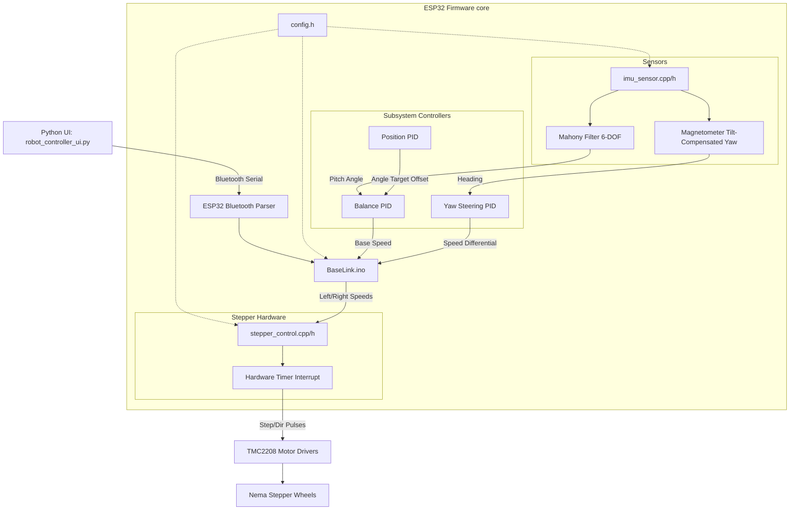

# System Architecture: Self-Balancing Robot

This document maps out the total physical and software ecosystem of the Self-Balancing Robot, explaining exactly how data flows from sensors down to the wheel movement.

## System Tree Map

## Directory & File Overview

### `BaseLink.ino`
- **Purpose:** The "Main Logic Loop". It dictates the master state machine (`STATE_IDLE`, `STATE_BALANCING`), calculates timestamps (`dt`), and pieces together the cascading PID outputs.
- **Controls:** Links the target position offset to the balance PID, and splits the final calculated motor speeds between the Left and Right wheels. Parses Bluetooth command payloads.

### `config.h`
- **Purpose:** The global dictionary. Every pin assignment, math ceiling limits (`MAX_SPEED_TILT`), initial PID parameters, and sensor mounting axis flags are isolated here so you don't have to hunt them down.

### `pid_controller.cpp / pid_controller.h`
- **Purpose:** Mathematical control laws. It takes `calculate Output = (Kp * Error) + (Ki * IntegralError) + (Kd * DerivativeError)`. 
- **Features:** It includes limits that cap maximum motor actions to prevent the robot from violently breaking hardware limits, and adaptive gains that boost `Kp` automatically if a crash goes beyond the `adaptiveThreshold`.

### `imu_sensor.cpp / imu_sensor.h`
- **Purpose:** Spatial awareness. It constantly reads the raw I2C Gyroscope, Accelerometer, and Magnetometer.
- **Features:** Runs a strict Mathematical 6-DOF integration that determines Pitch and Roll immune to magnetic interference, and combines the Magnetometer *afterward* to figure out North/South Yaw rotation. Also features an internal "vibration rejection" algorithm that ignores the Accelerometer during physical impacts.

### `stepper_control.cpp / stepper_control.h`
- **Purpose:** Wheel pulsing. Replaces `delay()` based movements entirely. 
- **Features:** It creates a rigid 20,000 Hz hardware timer that ticks inside a background Interrupt (ISR). It decides mathematically precisely when each DIR/STEP pin should flip High/Low thousands of times per second, guaranteeing flawlessly smooth wheel acceleration regardless of what the main `.ino` file is doing.

### `serial_tuner.h`
- **Purpose:** A legacy parser for handling direct USB serial inputs character by character. Largely replaced by the modern Python UI, but remains active as a reliable backup debugging suite.

### `robot_controller_ui.py`
- **Purpose:** The control center. It generates a Python-based physical window to decode the telemetric packets that the ESP32 broadcasts. It graphs the pitch live on a visualization canvas and allows mapping of the configuration sliders to immediately transmit parameter updates directly into the running ESP32 RAM over Bluetooth.
